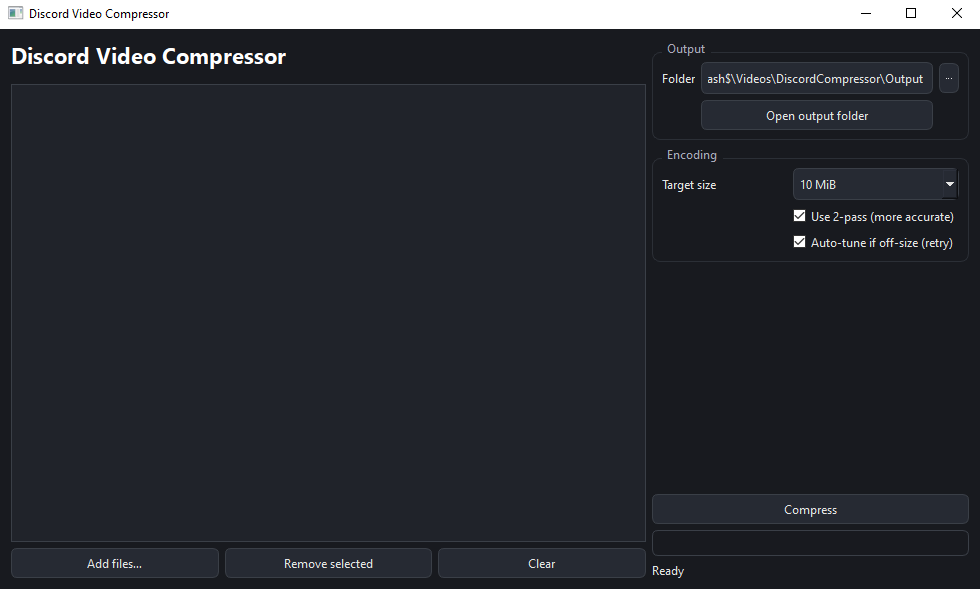

# Discord Video Compressor

**Discord Video Compressor** is a cross-platform GUI tool that lets you easily reduce video size to match Discord’s upload limits.  
It supports drag-and-drop, batch processing, and quick presets for 10 MB, 50 MB, and 500 MB.



## ✨ Features
- Sleek **dark mode** interface (PySide6)
- **Drag & Drop** multiple files
- Quick presets: **10 MB**, **50 MB**, **500 MB** (or custom value)
- **H.264 2-pass** encoding to hit the exact target size
- Real-time progress bar
- Choose output folder & “Open Output Folder” button
- Portable ffmpeg via **[imageio-ffmpeg](https://pypi.org/project/imageio-ffmpeg/)** (no system installation required)

## 📦 Installation
```bash
pip install PySide6 imageio-ffmpeg
````

## 🚀 Usage

```bash
python main.py
```

1. Drag videos into the window or click “Add video(s)”.
2. Select the target size (10 MB (Discord free plan), 50 MB (discord nitro basic plan), or 500 MB(discord nitro boost plan).
3. Click “Compress” and wait for encoding to finish.
4. Open the output folder to get your compressed files.

## 🛠 Dependencies

* [PySide6](https://pypi.org/project/PySide6/) – GUI framework
* [imageio-ffmpeg](https://pypi.org/project/imageio-ffmpeg/) – Embedded ffmpeg
